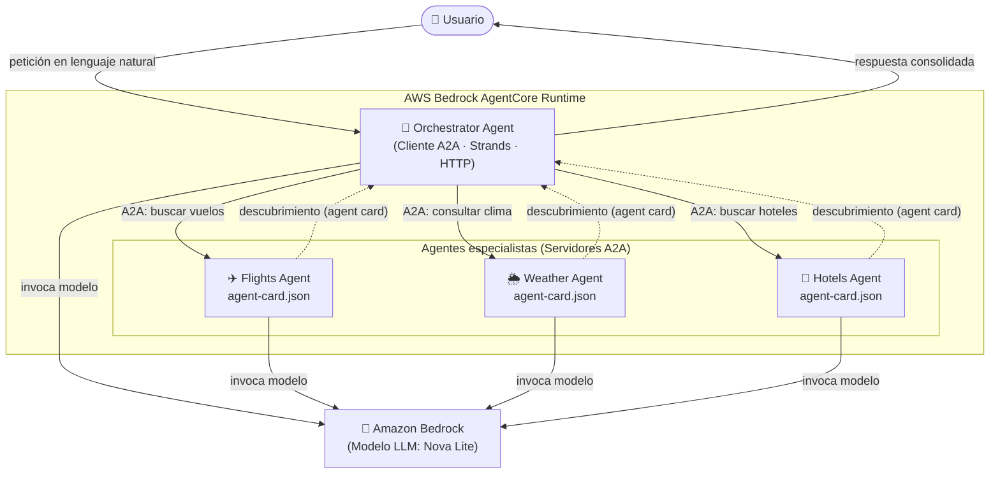

# Diagrama de Contexto — Trip Planner A2A

Vista de alto nivel: cómo se relacionan el usuario, el orquestador y los agentes especialistas, todos corriendo sobre **Bedrock AgentCore Runtime**.

## Los cuatro agentes

| Agente | Rol | Descripción |
|---|---|---|
| **Orchestrator Agent** | Cliente A2A | Recibe la petición del usuario, decide a qué especialistas consultar, los invoca vía A2A y compone la respuesta final. Es el único con el que habla el usuario. |
| **Flights Agent** | Servidor A2A | Expone la capacidad de buscar vuelos entre dos ciudades y una fecha (`search_flights`). Publica su `agent card` para que otros lo descubran. |
| **Weather Agent** | Servidor A2A | Expone la capacidad de consultar el pronóstico del clima para una ciudad y fecha (`get_weather_forecast`). También publica su `agent card`. |
| **Hotels Agent** | Servidor A2A | Expone la capacidad de buscar hoteles por ciudad, fecha de entrada y número de noches (`search_hotels`). También publica su `agent card`. |

## Por qué este diseño enseña A2A

El orquestador **no importa el código** de los especialistas ni comparte su memoria. Los descubre y los invoca por la red mediante un contrato estándar (el protocolo A2A). Cada agente podría estar escrito por un equipo distinto, en otro lenguaje, y aun así cooperarían. Eso es exactamente lo que A2A resuelve.

## Restricciones del ejercicio

| Restricción | Decisión del workshop | Motivo |
|---|---|---|
| Framework de agentes | Strands Agents (Python) | Soporte nativo de A2A (servidor y cliente). |
| Plataforma de despliegue | AWS Bedrock AgentCore Runtime | Requisito del workshop; runtime serverless para agentes. |
| Protocolo entre agentes | A2A (`protocol: "A2A"`) | Es el foco pedagógico. |
| Identity / autenticación | No se implementa | Reducir complejidad; concentrarse en la colaboración. |
| Fuentes de datos | Simuladas (mock) dentro de cada tool | Evitar dependencias externas y credenciales. |
