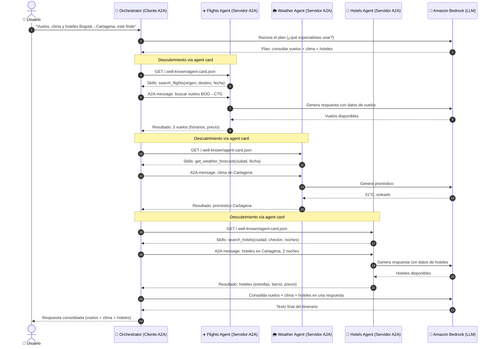

# Diagrama de Secuencia — Trip Planner A2A

Flujo temporal de una petición completa. Observa el paso de **descubrimiento** (lectura de la agent card) antes de la primera invocación de cada especialista.

## Puntos clave del flujo

1. **Descubrimiento dinámico**: el orquestador lee el `agent-card.json` de cada especialista antes de invocarlos. Esto permite conocer sus capacidades sin estar acoplado al código.

2. **Independencia de los especialistas**: `Flights Agent`, `Weather Agent` y `Hotels Agent` no se conocen entre sí. Solo hablan con el orquestador.

3. **LLM compartido**: los cuatro agentes usan Amazon Bedrock como motor de razonamiento, pero cada uno mantiene su propio contexto de conversación.

4. **Respuesta consolidada**: el orquestador es el único punto de contacto con el usuario — recibe los resultados parciales de los tres especialistas y genera una respuesta única y coherente.

## El problema que resuelve

Un usuario escribe una petición en lenguaje natural como:

> *"Quiero viajar de Bogotá a Cartagena el próximo fin de semana. ¿Qué vuelos hay, cómo estará el clima y en qué hotel me quedo?"*

Resolver esto requiere tres competencias distintas — buscar vuelos, consultar el clima y buscar hoteles. En lugar de un único agente monolítico, aplicamos **separación de responsabilidades**: cada competencia vive en su propio agente independiente, y un cuarto agente (el orquestador) los coordina.
