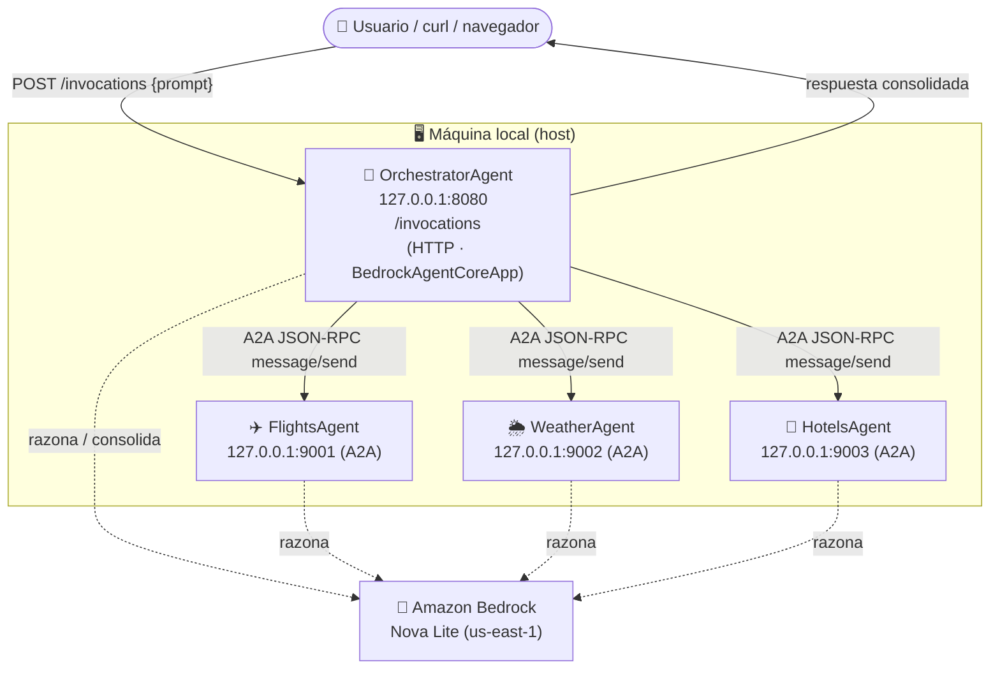
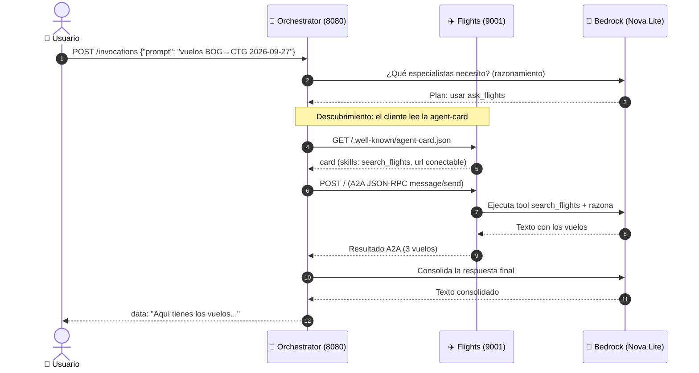

# Ejecución local, puertos y guion para el video

Cómo levantar los 4 agentes en local, cómo viaja la información entre ellos, y
un guion paso a paso para grabar el video explicativo al profesor.

---

## 1. Puertos de cada agente

| Agente | Rol | Puerto local | Protocolo |
|---|---|---|---|
| **OrchestratorAgent** | Cliente A2A (entrada del usuario) | **8080** | HTTP (`/invocations`) |
| **FlightsAgent** | Servidor A2A (vuelos) | **9001** | A2A (JSON-RPC) |
| **WeatherAgent** | Servidor A2A (clima) | **9002** | A2A (JSON-RPC) |
| **HotelsAgent** | Servidor A2A (hoteles) | **9003** | A2A (JSON-RPC) |

> En **AWS AgentCore** los especialistas corren todos en el puerto **9000**
> (cada uno en su microVM aislado, es requisito del runtime A2A). Los puertos
> 9001/9002/9003 son **solo para local**, para diferenciarlos en la misma
> máquina. Se fijan con la variable de entorno `PORT`.

---

## 2. Diagrama de despliegue local (puertos y conexiones)



**Detalle clave (por qué usamos 127.0.0.1 y no 0.0.0.0):**
El servidor A2A escucha en `0.0.0.0:PORT` (todas las interfaces), pero su
`agent-card` debe **anunciar** una URL conectable como cliente. Si anuncia
`0.0.0.0`, el cliente A2A falla (`ConnectError`). Por eso, en local levantamos
los especialistas con `PUBLIC_URL=http://127.0.0.1:PORT`, y el orquestador
apunta a `http://127.0.0.1:PORT`.

---

## 3. Cómo viaja la información (paso a paso)



1. El **usuario** hace `POST /invocations` al orquestador con el prompt.
2. El orquestador **razona** con Bedrock qué herramientas usar.
3. Por cada herramienta (`ask_flights`, `ask_weather`, `ask_hotels`), el
   cliente A2A **descubre** al especialista leyendo su `agent-card`.
4. Envía un **mensaje A2A** (JSON-RPC `message/send`) al especialista.
5. El especialista **ejecuta su tool** (datos mock) y razona con su LLM.
6. Devuelve el resultado por A2A.
7. El orquestador **consolida** todo en una respuesta y la transmite.
8. Si un especialista falla, entra la **degradación elegante** (reintenta 3
   veces; si falla, informa sin inventar datos).

---

## 4. Cómo levantar los 4 agentes en LOCAL

> Requisito: perfil AWS `agentcore-deployer` configurado y modelo Nova Lite
> habilitado en Bedrock. Todos los comandos limpian `AWS_BEARER_TOKEN_BEDROCK`
> (token viejo que rompe la auth) y fijan el perfil.

Abre **4 terminales**. En cada una:

### Terminal 1 — FlightsAgent (9001)
```powershell
cd workshop-a2a/app/FlightsAgent
$env:AWS_BEARER_TOKEN_BEDROCK=$null
$env:AWS_PROFILE='agentcore-deployer'; $env:AWS_REGION='us-east-1'
$env:PORT='9001'; $env:PUBLIC_URL='http://127.0.0.1:9001'
../../.venv/Scripts/python.exe main.py
```

### Terminal 2 — WeatherAgent (9002)
```powershell
cd workshop-a2a/app/WeatherAgent
$env:AWS_BEARER_TOKEN_BEDROCK=$null
$env:AWS_PROFILE='agentcore-deployer'; $env:AWS_REGION='us-east-1'
$env:PORT='9002'; $env:PUBLIC_URL='http://127.0.0.1:9002'
../../.venv/Scripts/python.exe main.py
```

### Terminal 3 — HotelsAgent (9003)
```powershell
cd workshop-a2a/app/HotelsAgent
$env:AWS_BEARER_TOKEN_BEDROCK=$null
$env:AWS_PROFILE='agentcore-deployer'; $env:AWS_REGION='us-east-1'
$env:PORT='9003'; $env:PUBLIC_URL='http://127.0.0.1:9003'
../../.venv/Scripts/python.exe main.py
```

### Terminal 4 — OrchestratorAgent (8080)
```powershell
cd workshop-a2a/app/OrchestratorAgent
$env:AWS_BEARER_TOKEN_BEDROCK=$null
$env:AWS_PROFILE='agentcore-deployer'; $env:AWS_REGION='us-east-1'
$env:PORT='8080'
../../.venv/Scripts/python.exe main.py
```

### Probar (Terminal 5)
```powershell
$body = '{"prompt":"Busca vuelos de BOG a CTG el 2026-09-27, el clima en CTG y hoteles en CTG para 2 noches. Hazlo ya."}'
Invoke-WebRequest -Uri "http://127.0.0.1:8080/invocations" -Method POST -Body $body -ContentType "application/json" -UseBasicParsing | Select-Object -Expand Content
```

> **Importante:** NO uses `agentcore dev -r OrchestratorAgent` para probar el
> flujo A2A completo. Ese modo aísla el orquestador en su propio sandbox y no
> ve a los especialistas en `127.0.0.1`. Corre el orquestador directo con
> Python (Terminal 4) para que comparta la red del host.

---

## 5. Verificar en la NUBE (AWS AgentCore)

```powershell
$env:AWS_PROFILE='agentcore-deployer'; $env:AWS_REGION='us-east-1'
agentcore status                         # los 4 runtimes READY
agentcore invoke --runtime OrchestratorAgent --target dev `
  "Busca vuelos de BOG a CTG el 2026-09-27, clima y hoteles en CTG"
```

Consola: `https://us-east-1.console.aws.amazon.com/bedrock-agentcore/runtimes?region=us-east-1`

---

## 6. Guion para el video explicativo (al profesor)

**Duración sugerida: 6-8 min.**

### (1) Introducción — el problema y el patrón A2A (1 min)
- "Construí un Trip Planner con arquitectura Agent-to-Agent: un orquestador
  que delega en 3 especialistas independientes (vuelos, clima, hoteles)."
- Muestra `docs/01-diagrama-contexto.md` y explica el desacoplamiento: el
  orquestador NO importa el código de los especialistas, los descubre por red.

### (2) Estructura del proyecto (1 min)
- Abre `docs/03-arquitectura-proyecto.md`.
- Muestra el árbol: cada agente tiene `data/` (mock), `tools.py`,
  `agent_card.py`, `server.py`, `main.py`. Capas separadas.
- Explica `shared/` y `scripts/sync_shared.py` (cómo se comparten utilidades).

### (3) Los puertos y cómo viaja la petición (1.5 min)
- Muestra el diagrama de la sección 2 y 3 de este documento.
- Explica: usuario → orquestador (8080) → A2A a especialistas (9001/2/3) →
  Bedrock → respuesta consolidada.

### (4) Demo LOCAL (2 min)
- Muestra las 4 terminales con los agentes corriendo.
- Haz la petición (sección 4). Muestra la respuesta con vuelos, clima y hoteles
  REALES (datos mock).
- Muestra en la consola de un especialista cómo le llega el POST message/send
  (evidencia de la invocación A2A).

### (5) Demo NUBE (1.5 min)
- `agentcore status`: los 4 runtimes READY en AWS.
- La consola de AWS Bedrock AgentCore con los 4 runtimes.
- `agentcore invoke ...`: la misma petición, respondida desde la nube.

### (6) Retos avanzados y cierre (1 min)
- Tercer especialista (Hotels), streaming, patrón swarm, manejo de fallos
  (degradación elegante con reintentos).
- Cierre: "A2A permite que agentes independientes, desplegables por separado,
  colaboren mediante un contrato estándar. Eso es lo que resuelve el patrón."

---

## 7. Criterio de éxito (para la rúbrica)

- ✅ El orquestador devuelve UNA respuesta que combina vuelos + clima + hoteles.
- ✅ Los datos provienen de los especialistas vía A2A (no inventados).
- ✅ Se observan las invocaciones A2A en las consolas de los especialistas.
- ✅ Funciona en local (4 procesos) y en la nube (4 runtimes AgentCore READY).
- ✅ Ante fallo de un especialista, degrada elegantemente sin inventar datos.
