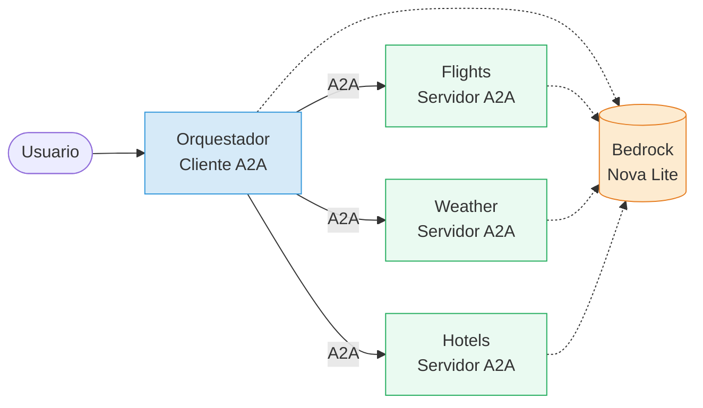
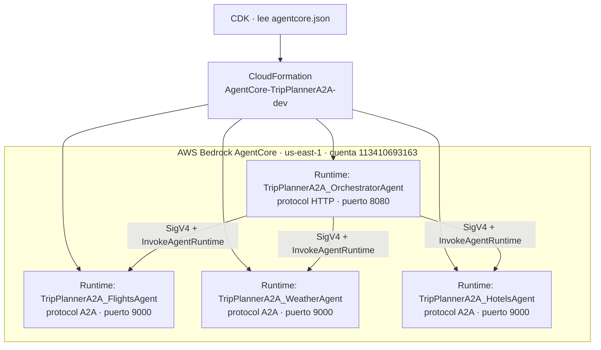

# Documento Arquitectónico — Trip Planner A2A

Decisiones de arquitectura, principios, capas y vistas del sistema.

---

## 1. Propósito del sistema

Resolver, con múltiples agentes de IA que colaboran, una petición de viaje en
lenguaje natural como:

> *"Quiero viajar de Bogotá a Cartagena el 27 de septiembre. ¿Qué vuelos hay,
> cómo estará el clima y en qué hotel me quedo?"*

En lugar de un agente monolítico que lo sepa todo, se aplica **separación de
responsabilidades**: cada competencia (vuelos, clima, hoteles) vive en su propio
agente independiente, y un orquestador los coordina mediante el protocolo
**Agent-to-Agent (A2A)**.

---

## 2. Estilo arquitectónico

**Microservicios de agentes + patrón Orquestador/Especialistas.**

- Cada agente es un **runtime independiente** en AWS Bedrock AgentCore,
  desplegable, versionable y escalable por separado.
- El **orquestador** es un cliente A2A: la única puerta de entrada del usuario.
- Los **especialistas** son servidores A2A: exponen capacidades vía `agent-card`
  y responden mensajes JSON-RPC.
- La comunicación entre agentes es **por red, con contrato estándar A2A**. Ningún
  agente importa el código ni comparte memoria con otro.



---

## 3. Principios de diseño (drivers)

| Principio | Cómo se materializa |
|---|---|
| **Desacoplamiento** | El orquestador solo conoce URLs de los especialistas (env vars), nunca su código. |
| **Responsabilidad única** | Cada agente resuelve una sola competencia. |
| **Descubrimiento dinámico** | Los especialistas publican su `agent-card`; el cliente la lee antes de invocar. |
| **Interoperabilidad** | Contrato estándar A2A (JSON-RPC), independiente del lenguaje/framework. |
| **Modularidad interna** | Cada agente separa capas: datos → tools → agente → servidor → entrypoint. |
| **Tolerancia a fallos** | Reintentos con backoff + degradación elegante si un especialista no responde. |
| **Observabilidad** | Logging JSON estructurado + trazas de AgentCore/CloudWatch. |

---

## 4. Vista de capas (dentro de cada agente)

```mermaid
flowchart TB
    subgraph Agente["Un agente especialista"]
        M[main.py<br/>entrypoint] --> S[server.py<br/>A2AServer factory]
        S --> AG[Agent Strands<br/>modelo + tools]
        AG --> T[tools.py<br/>@tool función pura]
        T --> D[data/mock.py<br/>datos aislados]
        S --> C[agent_card.py<br/>skills A2A]
    end
    SH[shared/<br/>config + logging] -.-> M
    SH -.-> S
```

Beneficio: para pasar de datos mock a una API real (Duffel, OpenWeather,
Booking) solo se cambia `data/mock.py`. El resto del agente no se toca.

---

## 5. Vista de despliegue



- Cada runtime corre en su propio **microVM aislado**.
- El despliegue se declara en `agentcore.json` y lo materializa **CDK →
  CloudFormation**.
- La invocación entre runtimes usa **SigV4** (auth AWS_IAM) + permiso
  `bedrock-agentcore:InvokeAgentRuntime`.

---

## 6. Decisiones arquitectónicas clave (ADR resumido)

### ADR-1: A2A como protocolo entre agentes
- **Decisión:** usar el protocolo A2A (no llamadas ad-hoc ni un monolito).
- **Razón:** es el foco pedagógico; habilita interoperabilidad y desacoplamiento.
- **Consecuencia:** cada especialista publica `agent-card` y habla JSON-RPC.

### ADR-2: Modelo Amazon Nova Lite
- **Decisión:** `us.amazon.nova-lite-v1:0`.
- **Razón:** se habilita al instante en cuentas nuevas (Anthropic exige
  formulario de caso de uso). Suficiente para orquestación con tools.

### ADR-3: Datos mock aislados en `data/`
- **Decisión:** datos simulados en un módulo separado por agente.
- **Razón:** evitar credenciales/dependencias externas; cambio a producción = 1 archivo.

### ADR-4: Módulo `shared` sincronizado
- **Decisión:** `scripts/sync_shared.py` copia `app/shared/` dentro de cada agente.
- **Razón:** AgentCore empaqueta solo el `codeLocation`; `shared` externo no viajaría.

### ADR-5: Autenticación SigV4 + card pre-inyectada (nube)
- **Decisión:** firmar A2A con SigV4 y pre-inyectar la `agent-card`.
- **Razón:** en AgentCore el GET al `agent-card` responde 403; el POST
  `message/send` firmado sí funciona. Pre-inyectar la card salta el GET.

### ADR-6: `PUBLIC_URL` en local
- **Decisión:** los especialistas anuncian `http://127.0.0.1:PORT` vía `PUBLIC_URL`.
- **Razón:** si la card anuncia `0.0.0.0`, el cliente A2A no puede conectar
  (`ConnectError`). Con `127.0.0.1` el POST llega bien.

### ADR-7: Sin identity (por alcance)
- **Decisión:** no se implementa autenticación de usuario final.
- **Razón:** el workshop se enfoca en la colaboración, no en identity. En la
  nube, el aislamiento de red de AgentCore + IAM/SigV4 cubren el escenario.

---

## 7. Atributos de calidad

| Atributo | Cómo se aborda |
|---|---|
| **Escalabilidad** | Cada agente escala independiente (microVM por sesión). |
| **Disponibilidad** | Degradación elegante: si un especialista cae, el resto responde. |
| **Mantenibilidad** | Capas separadas; datos mock aislados; imports absolutos. |
| **Portabilidad** | Mismo código corre en local (Python) y en AgentCore (CodeZip). |
| **Seguridad** | SigV4 (AWS_IAM), permisos IAM mínimos, sin secretos en el código. |
| **Observabilidad** | Logs JSON + CloudWatch + trazas AgentCore. |

---

## 8. Límites del sistema (alcance)

- Datos **simulados** (no APIs reales de vuelos/clima/hoteles).
- **Sin identity** de usuario final.
- Un solo entorno de despliegue (`dev`).
- Región única (`us-east-1`).

Estos límites son intencionales para centrar el workshop en el patrón A2A.
