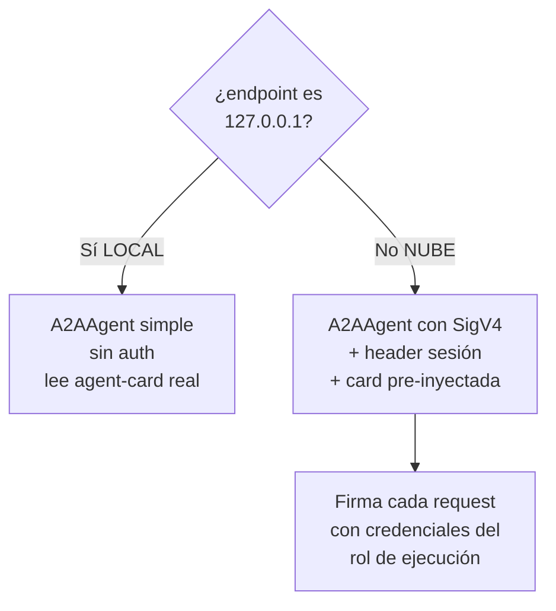
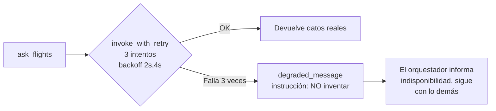

# Servicios y comunicación entre agentes

Descripción de cada servicio (qué hace, qué expone) y cómo se comunican entre
sí paso a paso, con diagramas.

---

## 1. Catálogo de servicios

| Servicio | Tipo | Protocolo | Puerto local / nube | Capacidad |
|---|---|---|---|---|
| **OrchestratorAgent** | Cliente A2A | HTTP | 8080 / 8080 | Coordina y consolida. Punto de entrada del usuario. |
| **FlightsAgent** | Servidor A2A | A2A (JSON-RPC) | 9001 / 9000 | `search_flights(origin, destination, date)` |
| **WeatherAgent** | Servidor A2A | A2A (JSON-RPC) | 9002 / 9000 | `get_weather_forecast(city, date)` |
| **HotelsAgent** | Servidor A2A | A2A (JSON-RPC) | 9003 / 9000 | `search_hotels(city, checkin, nights)` |

---

## 2. FlightsAgent (servidor A2A)

**Qué hace:** busca vuelos entre dos ciudades colombianas para una fecha.

**Datos que devuelve** (por vuelo): `flight`, `airline`, `origin`, `destination`,
`date`, `depart`, `arrive`, `duration_min`, `cabin`, `price_usd`, `stops`.

**Rutas del catálogo mock:** BOG↔CTG, BOG↔MDE, MDE→BOG, BOG→CLO.

**Endpoints que publica** (via Strands `A2AServer`):
- `GET /.well-known/agent-card.json` — descubrimiento.
- `POST /` y `POST /message:send` — enviar mensaje A2A (JSON-RPC).
- `POST /message:stream` — streaming (SSE).

**Archivos:** `data/mock.py` (datos) → `tools.py` (`search_flights`) →
`agent_card.py` (skill) → `server.py` (A2AServer) → `main.py` (arranque).

---

## 3. WeatherAgent (servidor A2A)

**Qué hace:** pronóstico del clima por ciudad y fecha.

**Datos:** `city`, `country`, `date`, `temp_c`, `temp_min_c`, `temp_max_c`,
`condition`, `humidity_pct`, `wind_kmh`, `precipitation_mm`, `uv_index`,
`sunrise`, `sunset`. Acepta código IATA o nombre de ciudad.

**Ciudades mock:** Cartagena (CTG), Bogotá (BOG), Medellín (MDE), Cali (CLO),
Barranquilla (BAQ).

---

## 4. HotelsAgent (servidor A2A)

**Qué hace:** busca hoteles por ciudad, con precio total según noches.

**Datos:** `hotel`, `stars`, `city`, `neighborhood`, `checkin`, `nights`,
`price_per_night_usd`, `total_usd`, `rating`, `breakfast_included`, `amenities`.

**Hoteles mock** (basados en hoteles reales): Cartagena (Hilton, Hyatt Regency,
Casa Isabel, Hotel Caribe), Bogotá (Sofitel Victoria Regia, HAB, Maceo Chico),
Medellín (The Landmark, Lettera, Torre Primavera), Cali, Barranquilla.

---

## 5. OrchestratorAgent (cliente A2A)

**Qué hace:** recibe la petición del usuario, decide qué especialistas
consultar, los invoca vía A2A, y consolida una única respuesta.

**Herramientas de delegación** (el LLM decide cuál usar):
- `ask_flights(request)` → FlightsAgent
- `ask_weather(request)` → WeatherAgent
- `ask_hotels(request)` → HotelsAgent

**Módulos:**
- `a2a_clients.py` — crea los clientes `A2AAgent` remotos, firma SigV4 (nube),
  reintentos, degradación.
- `tools.py` — las 3 tools de delegación.
- `agent.py` — factory del orquestador + system prompt (política de delegación).
- `swarm.py` — variante multi-agente (reto Graph/Swarm).
- `streaming.py` — streaming end-to-end (reto avanzado).
- `main.py` — entrypoint `BedrockAgentCoreApp`.

---

## 6. Cómo se comunican (mecanismo A2A)

### 6.1. Descubrimiento (agent-card)

El cliente A2A, antes de invocar, lee el `agent-card` del especialista:

```
GET {endpoint}/.well-known/agent-card.json
→ { name, description, skills:[{id,name,description,tags}], url, capabilities }
```

La `url` de la card es a dónde el cliente enviará los mensajes.

### 6.2. Invocación (message/send)

El cliente envía un mensaje JSON-RPC 2.0:

```json
POST {url}
{
  "jsonrpc": "2.0",
  "id": "req-001",
  "method": "message/send",
  "params": {
    "message": {
      "role": "user",
      "parts": [{ "kind": "text", "text": "Vuelos de BOG a CTG el 2026-09-27" }],
      "messageId": "uuid"
    }
  }
}
```

El especialista responde con un `Message` o un `Task` que contiene el resultado.

### 6.3. Autenticación según entorno



- **Local:** sin autenticación. El servidor publica su card normalmente.
- **Nube:** cada petición se firma con **SigV4** (servicio `bedrock-agentcore`).
  Además, el rol de ejecución del orquestador tiene el permiso
  `bedrock-agentcore:InvokeAgentRuntime`. Como el GET del agent-card da 403 en
  AgentCore, se **pre-inyecta** una card construida localmente para saltar ese
  GET e ir directo al POST firmado.

### 6.4. Tolerancia a fallos



---

## 7. Contrato entre servicios (resumen)

| Aspecto | Valor |
|---|---|
| Formato de mensaje | JSON-RPC 2.0 (`method: message/send`) |
| Contenido | `parts` con `text` (lenguaje natural) |
| Descubrimiento | `GET /.well-known/agent-card.json` |
| Transporte | HTTP(S) |
| Auth local | Ninguna |
| Auth nube | AWS SigV4 (servicio `bedrock-agentcore`) + header de sesión |
| Respuesta | `Message`/`Task` con `parts` de texto |
| Errores | JSON-RPC error codes / HTTP status; el cliente degrada |

---

## 8. Independencia de los servicios

- Los especialistas **no se conocen entre sí**. Solo hablan con el orquestador.
- El orquestador **no importa** el código de los especialistas: solo sus URLs.
- Cada servicio se **despliega, versiona y escala por separado**.
- Un especialista nuevo (p.ej. `CarRentalAgent`) se suma sin tocar a los demás:
  se despliega, se añade su URL al orquestador y una tool `ask_cars`.
