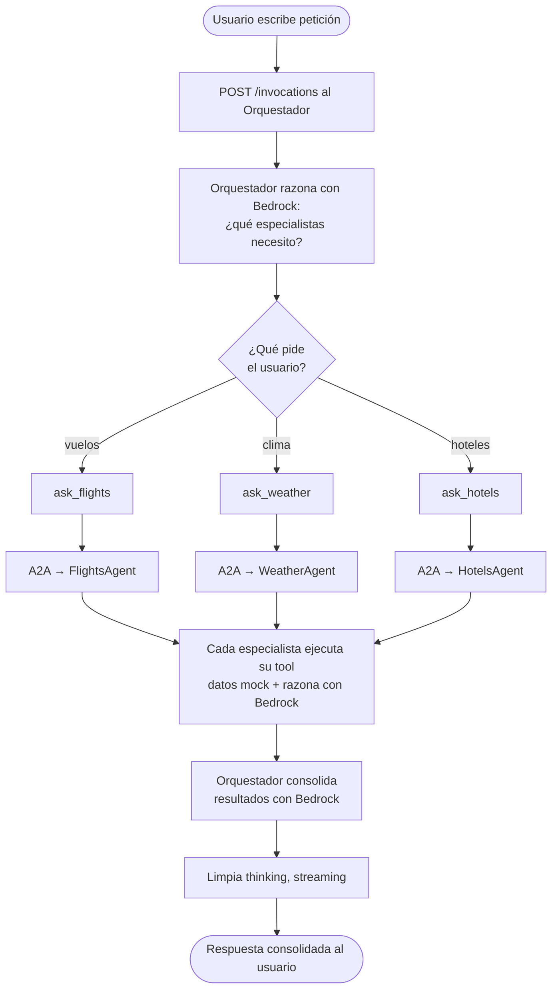
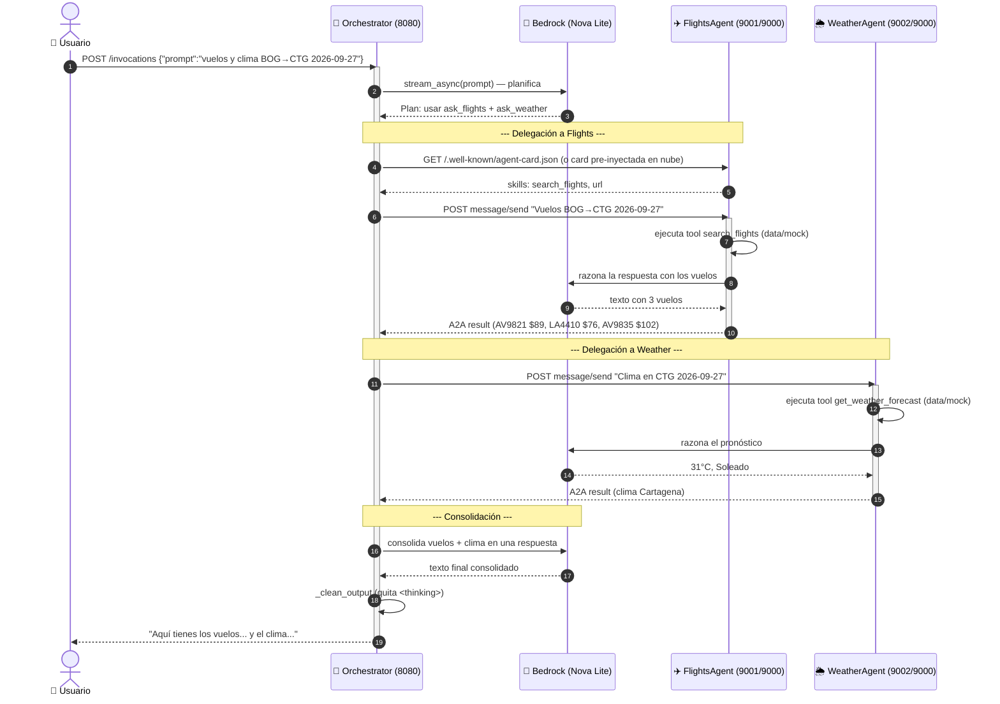
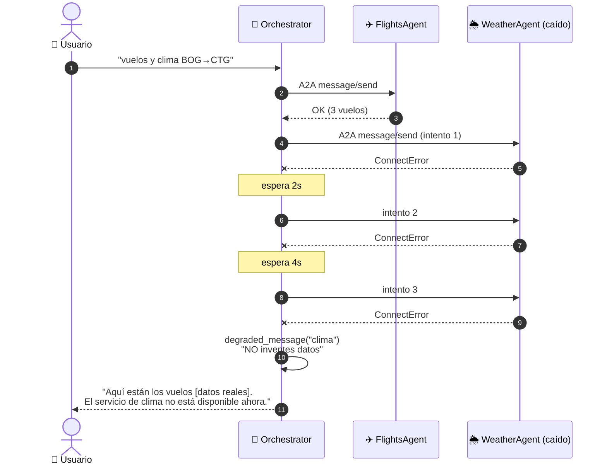
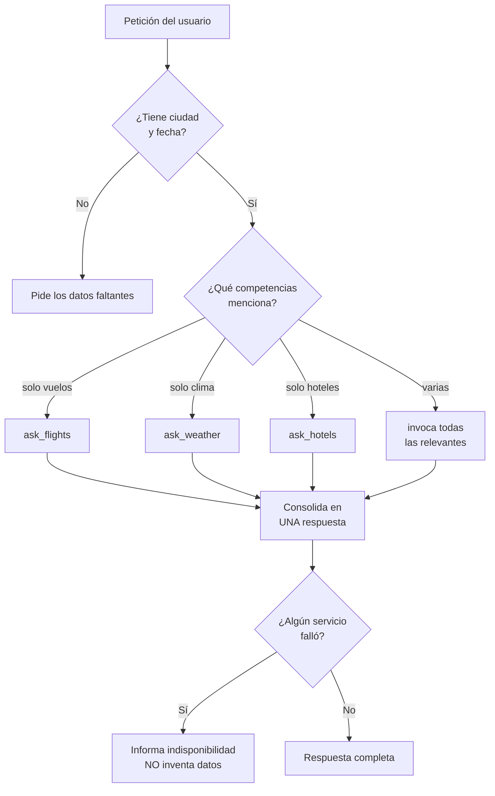

# Flujo de una petición — diagramas paso a paso

Qué ocurre exactamente desde que el usuario escribe hasta que recibe la
respuesta consolidada. Incluye el flujo feliz, el flujo con fallo, y el detalle
técnico interno.

---

## 1. Flujo general (alto nivel)



---

## 2. Diagrama de secuencia detallado (flujo feliz)

Escenario: *"Vuelos y clima de Bogotá a Cartagena el 2026-09-27"*.



---

## 3. Flujo con fallo de un especialista (degradación elegante)

Escenario: el WeatherAgent no responde (cold start / caído).



Clave: el orquestador **NO inventa** el clima; informa la indisponibilidad y
entrega lo que sí obtuvo (los vuelos). Esto es la degradación elegante.

---

## 4. Detalle técnico: qué hace el código en cada paso

| # | Paso | Archivo / función |
|---|---|---|
| 1 | Recibe `POST /invocations` | `main.py` → `@app.entrypoint invoke()` |
| 2 | Valida que `prompt` es string | `main.py` |
| 3 | Construye el agente | `agent.py` → `build_agent()` |
| 4 | El LLM decide qué tool usar | Strands + system prompt |
| 5 | Ejecuta la tool de delegación | `tools.py` → `ask_flights/weather/hotels` |
| 6 | Crea el cliente A2A (local o SigV4) | `a2a_clients.py` → `_make_client()` |
| 7 | Reintenta si falla (cold start) | `a2a_clients.py` → `invoke_with_retry()` |
| 8 | Descubre y envía mensaje A2A | Strands `A2AAgent.invoke_async()` |
| 9 | El especialista ejecuta su tool | (FlightsAgent) `tools.py` → `search_flights` |
| 10 | El especialista consulta datos | `data/mock.py` → `get_flights()` |
| 11 | Si falla, mensaje degradado | `a2a_clients.py` → `degraded_message()` |
| 12 | Consolida y limpia la salida | `main.py` → `_clean_output()` |
| 13 | Transmite al usuario | `main.py` → `yield` |

---

## 5. Formato de la petición y la respuesta

### Petición del usuario al orquestador (HTTP)
```json
POST http://127.0.0.1:8080/invocations
{ "prompt": "Vuelos de BOG a CTG el 2026-09-27, clima y hoteles en CTG" }
```

Payload opcional para modos avanzados:
```json
{ "prompt": "...", "mode": "swarm" }                          // patrón multi-agente
{ "prompt": "...", "stream_direct": true, "specialist": "flights" }  // streaming directo
```

### Mensaje A2A del orquestador al especialista (JSON-RPC)
```json
POST {endpoint}/
{
  "jsonrpc": "2.0", "id": "req-001", "method": "message/send",
  "params": { "message": {
    "role": "user",
    "parts": [{ "kind": "text", "text": "Vuelos de BOG a CTG el 2026-09-27" }],
    "messageId": "uuid"
  }}
}
```

### Respuesta consolidada al usuario (streaming SSE)
```
data: "Aquí tienes los vuelos de Bogotá a Cartagena:
1. Avianca AV9821 — 07:15/08:25 — $89.00
2. LATAM LA4410 — 12:40/13:50 — $76.00
3. Avianca AV9835 — 18:05/19:15 — $102.00

Clima en Cartagena: 31°C, Soleado. Lleva ropa ligera.

Hoteles (2 noches): Hilton Cartagena (Bocagrande) $380 total, ..."
```

---

## 6. Puntos de decisión del orquestador (LLM)



Estas decisiones las toma el LLM guiado por el **system prompt** de `agent.py`,
que incluye las reglas anti-alucinación y de consolidación.
